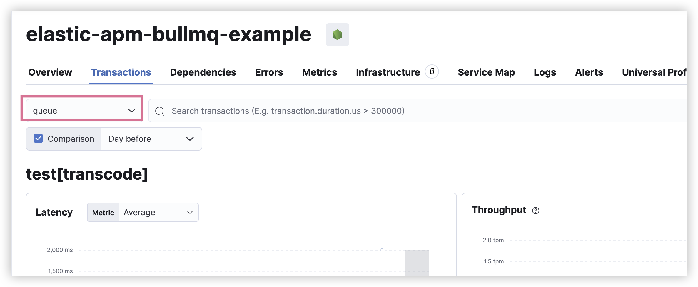
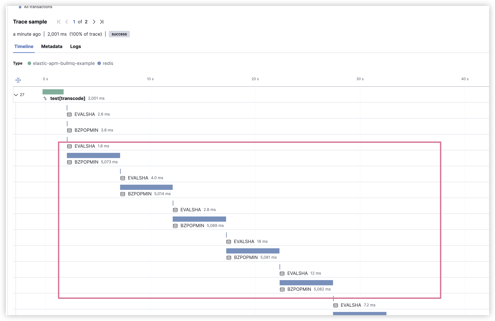

# elastic apm bullmq example

[bullmq.js](bullmq.js) is apm collection for bullmq

```bash
npm install
```

run the following command to start the server
```bash
export ELASTIC_APM_SECRET_TOKEN=YOUR_TOKEN && export ELASTIC_APM_SERVER_URL=YOUR_URL && export NODE_OPTIONS="-r elastic-apm-node/start.js" && npm run start:dev
```

request the following url to test the apm
```
http://localhost:3000/
```

view your elastic apm





